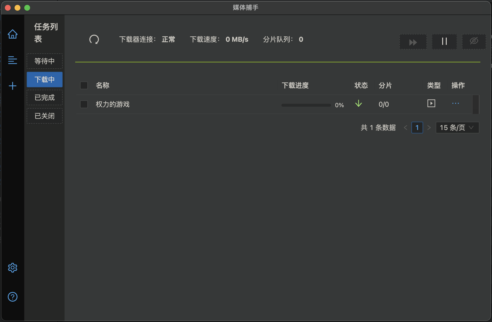

# N_m3u8DL-RE-GUI
这是一个带有用户界面的 m3u8 下载器，主要内容是对 [N_m3u8DL-RE](https://github.com/nilaoda/N_m3u8DL-RE) 的包装

## 简介
程序还需要继续完善，暂时有打包好的 windows、macos 安装包，以后如果有需要的话会把程序代码开源。 

因为 N_m3u8DL-RE 已经支持跨平台了，但是还不包含用户界面，所以我就来搞一下。

安装包的下载地址：[https://github.com/j-wyatt-a/N_m3u8DL-RE-GUI/releases](https://github.com/j-wyatt-a/N_m3u8DL-RE-GUI/releases)

happy hacking!

## 截图展示

## 功能设想
- 使用 js 编写
- 可以跨平台使用
- 接收本地下载器数据
- 接收远程下载器数据
- 利用 js 包装下载器执行文件，这个包装器起服务端作用
- 服务端可以管理多个下载任务
- 服务端可以编译成执行文件，支持多平台和远程调用
- 程序总体采用 CS 结构，服务端包含下载器，客户端包含界面
- 数据库放在服务端

## 异常情况的处理办法
- 删掉目录 ~/.n3_server，然后重启

## 感谢
- N_m3u8DL-RE
- electron
- math
